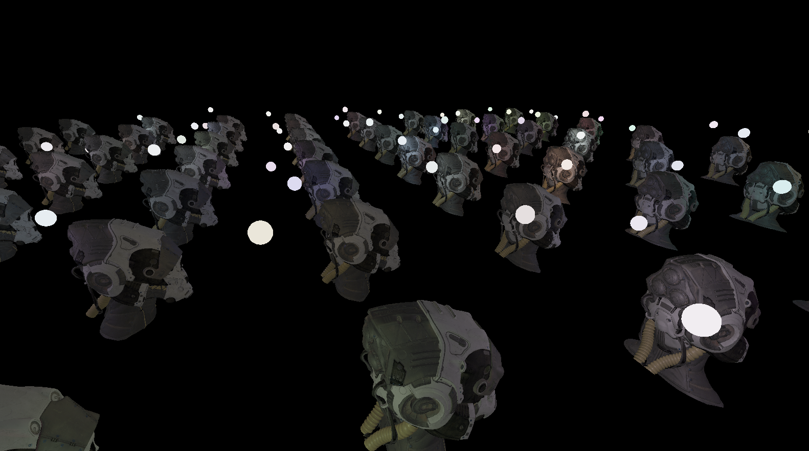

# Features
- bindless style render achieved by using texture array wgpu feature.
- deferred shading using light volume meshes
- tone mapping
- loading GLTF models
- normal mapping
- pbr
# Example
Example using [SciFiHelmet](https://github.com/KhronosGroup/glTF-Sample-Assets/tree/main/Models/SciFiHelmet) model from gltf sample assets 

# Running
Requires to have installed on of the backends supported by wgpu, see wgpu repo for more info.
When running the app supply a path to gltf model via cli argument

